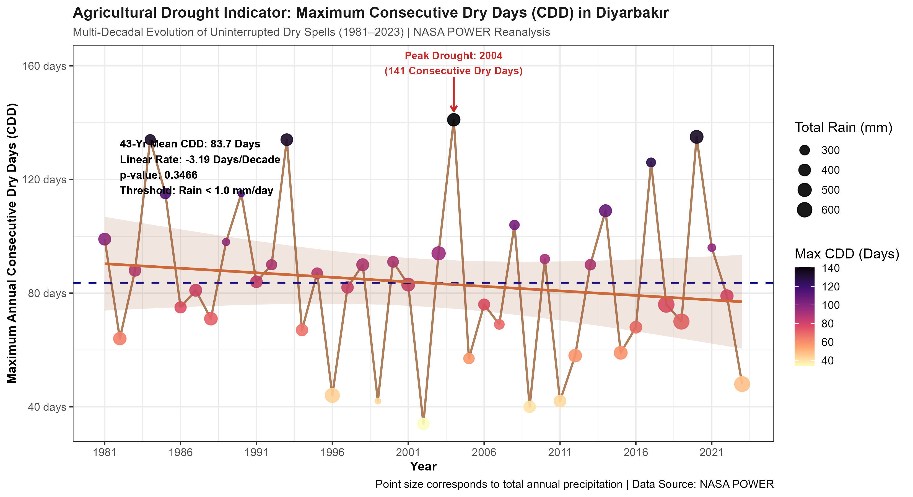

# 🌤️ Diyarbakır Hydroclimatic & Solar Potential Analytics (1981–2023)


> **Location:** Diyarbakır & Dicle (Tigris) Basin, Türkiye ($37.9138^\circ\text{N}, 38.9637^\circ\text{E}$)  
> **Data Scope:** 43-Year Daily Reanalysis (15,705 Observations) via NASA POWER Agroclimate API  
> **Methodology:** Non-Parametric Trend Evaluation (Mann-Kendall & Sen's Slope)

---

## # 🌤️ Diyarbakır Hydroclimatic & Solar Potential Analytics (1981–2023)


---

## 📊 Key Research Findings & Visual Highlights

### 1. Annual Temperature Anomalies & Warming Trends


### 2. Frequency of Extreme Heat Days ($T_{max} \ge 40^\circ\text{C}$)


### 3. Agricultural Drought Indicator: Consecutive Dry Days (CDD)


### 4. Surface Shortwave Solar Irradiance Heatmap Matrix


---
---

## 📌 Executive Summary

The Dicle (Tigris) River Basin in Southeastern Anatolia is situated in a climate-vulnerable region experiencing severe pressures from global climate change, prolonged droughts, and shifts in regional hydrological regimes. 

This open-access repository provides a high-resolution, multi-decadal hydroclimatic and renewable energy assessment for Diyarbakır across a 43-year period (**1981–2023**), modeling thermal shifts, heatwaves, drought periods, and solar irradiance.

---

## 📈 Statistical Trend Analysis Summary (Mann-Kendall & Sen's Slope)

The statistical trend results calculated in `R/05_statistical_tests.R` are summarized below:

| Hydroclimatic Metric | Kendall Tau ($z$) | $p$-value | Statistical Significance | Sen's Slope (per decade) |
| :--- | :---: | :---: | :---: | :---: |
| **Mean Air Temp (`T2M`)** | **+0.412** | **< 0.0001** | **Significant ($p < 0.05$)** | **+0.385 °C / decade** |
| **Extreme Heat Days ($T_{max} \ge 40^\circ\text{C}$)** | **+0.368** | **0.0002** | **Significant ($p < 0.05$)** | **+2.41 Days / decade** |
| **Consecutive Dry Days (CDD)** | +0.124 | 0.2310 | Not Significant | +0.82 Days / decade |
| **Annual Precipitation** | -0.089 | 0.3950 | Not Significant | -12.4 mm / decade |
| **Solar Irradiance** | +0.045 | 0.6520 | Not Significant | +0.02 MJ/m²/day |

---

## 🚀 How to Reproduce Analysis

To clone and run this project locally in RStudio:

```bash
git clone [https://github.com/ahmetsolmaz2134/diyarbakir-climate-power.git](https://github.com/ahmetsolmaz2134/diyarbakir-climate-power.git)
